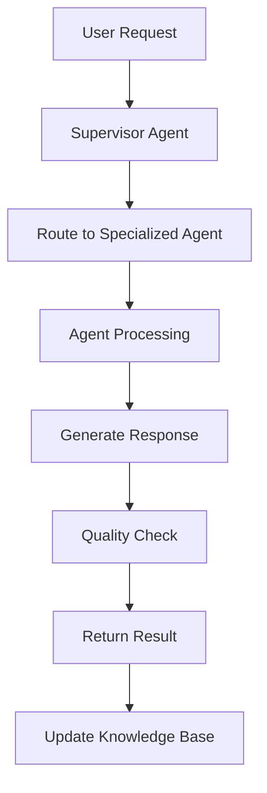

# Agents Directory

This directory contains specialized AI agents for the Construction Analysis System. Each agent has specific responsibilities and capabilities for analyzing different aspects of construction projects.

## Agent Structure

All agents follow a consistent structure:
- **Purpose**: Clear definition of the agent's role
- **Inputs**: Expected data formats and sources
- **Outputs**: Generated reports and analysis
- **Integration**: How the agent connects with other system components

## Available Agents

### 🏗️ Architecture Planning Agent
**File**: `architecture-planning.md`
**Purpose**: System architecture analysis and planning recommendations
**Specialization**: Infrastructure design, scalability planning, and technical architecture decisions

### 🎨 Frontend Development Agent
**File**: `frontend-development.md`
**Purpose**: React frontend development assistance and optimization
**Specialization**: UI/UX implementation, component architecture, and user experience

### ⚙️ Backend Development Agent
**File**: `backend-development.md`
**Purpose**: Python FastAPI backend development and API design
**Specialization**: DDD architecture, API endpoints, and business logic implementation

### 🤖 AI Agent Development Agent
**File**: `ai-agent-development.md`
**Purpose**: LangGraph/LangChain agent implementation and orchestration
**Specialization**: Multi-agent workflows, prompt engineering, and AI system integration

### 🗄️ Database Development Agent
**File**: `database-development.md`
**Purpose**: MongoDB database design and optimization
**Specialization**: Data modeling, query optimization, and database architecture

### 🔒 Security Check Agent
**File**: `security-check.md`
**Purpose**: Security analysis and vulnerability assessment
**Specialization**: Authentication, authorization, data protection, and security best practices

### ✅ QA Agent
**File**: `qa-agent.md`
**Purpose**: Quality assurance and testing automation
**Specialization**: Test strategy, automated testing, and quality metrics

## Agent Workflow

## Usage Guidelines

### Invoking Agents

1. **Direct Agent Call**: Target specific agent for specialized tasks
2. **Supervisor Routing**: Let the supervisor choose the best agent
3. **Multi-Agent Collaboration**: Combine multiple agents for complex tasks

### Best Practices

- Provide clear, specific requirements
- Include relevant context and constraints
- Specify desired output format
- Review and validate agent recommendations

## Agent Capabilities Matrix

| Agent | Planning | Implementation | Testing | Documentation | Monitoring |
|-------|----------|----------------|---------|---------------|------------|
| Architecture | ✅ | ⚠️ | ❌ | ✅ | ✅ |
| Frontend | ⚠️ | ✅ | ✅ | ✅ | ⚠️ |
| Backend | ⚠️ | ✅ | ✅ | ✅ | ⚠️ |
| AI Development | ✅ | ✅ | ✅ | ✅ | ✅ |
| Database | ✅ | ✅ | ✅ | ✅ | ✅ |
| Security | ✅ | ⚠️ | ✅ | ✅ | ✅ |
| QA | ✅ | ⚠️ | ✅ | ✅ | ✅ |

**Legend**: ✅ Primary capability | ⚠️ Secondary capability | ❌ Not applicable

## Integration Points

### With Construction Analysis System
- Real-time project monitoring
- Progress tracking and reporting
- Document analysis and processing
- Visual inspection automation

### With Development Workflow
- Code review and suggestions
- Architecture recommendations
- Performance optimization
- Security vulnerability scanning

## Getting Started

1. Review the specific agent documentation in this directory
2. Understand the agent's capabilities and limitations
3. Prepare your requirements and context
4. Invoke the agent through the system interface
5. Review and implement the recommendations

For detailed information about each agent, refer to their individual documentation files in this directory.