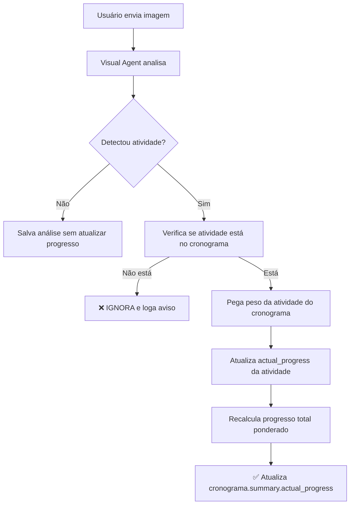

# 📸 Como Funciona a Análise de Imagens e Atualização de Progresso

## 🎯 Problema Identificado

Quando o usuário envia imagens da obra, o sistema estava:
1. Detectando atividades que **não estavam no cronograma**
2. Criando entradas arbitrárias com peso de 3.57% (100/28)
3. Isso fazia o progresso **cair drasticamente**

**Exemplo do problema:**
- Cronograma esperava: 7.58% de progresso
- Usuário envia foto de infraestrutura elétrica
- Sistema detecta atividade não cadastrada e cria entrada com 3.57% de peso
- Progresso real cai para 2.48%

## ✅ Solução Implementada

Agora o sistema **só atualiza atividades que estão no cronograma cadastrado**.

### Fluxo de Análise de Imagens



## 🔍 Logs Detalhados

Agora o sistema loga cada etapa para facilitar debugging:

### 1. Detecção da Imagem
```log
🔍 Imagem detectou: atividade='infra_eletrica', progresso=45%
```

### 2. Busca no Cronograma
```log
📋 Cronograma tem 28 atividades cadastradas
🔎 Procurando atividade 'infra_eletrica' no cronograma...
```

### 3a. Se Encontrou a Atividade
```log
✅ Atividade 'infra_eletrica' encontrada no cronograma:
   Peso no projeto: 5.0%
   Progresso atual: 0%
   Progresso detectado: 45%
   Novo progresso: 45%

📈 Updated activity 'infra_eletrica': 0% → 45%
📊 Updated cronograma.summary.actual_progress: 2.25%
ℹ️  overall_progress permanece em 7.58% (progresso do cronograma baseado em datas)
✅ Cronograma updated for project uuid-123
```

**Cálculo:**
- Peso da atividade: 5%
- Progresso detectado: 45%
- Contribuição ao total: 5% * 45% = 2.25%

### 3b. Se NÃO Encontrou a Atividade
```log
⚠️ Atividade 'ceramica_piso' NÃO encontrada no cronograma cadastrado!
   Atividades disponíveis no cronograma: ['prumada', 'alvenaria', 'contrapiso', 'instala...]...
   Esta detecção será IGNORADA. Para considerar, adicione 'ceramica_piso' ao cronograma.
   Progresso detectado na imagem (30%) não será aplicado ao total.
```

## 📊 Estrutura de Dados

### No MongoDB (`metadata.cronograma`)

```json
{
  "activities": {
    "infra_eletrica": {
      "percentage": 5.0,              // Peso da atividade no projeto
      "duration_days": 15,
      "start_date": "2025-03-24",
      "end_date": "2025-04-10",
      "expected_progress": 100,       // Esperado baseado em datas (100% = concluído)
      "actual_progress": 45,          // ← ATUALIZADO pela análise de imagem
      "status": "em_andamento",
      "last_detected": "2025-10-03T21:42:00"
    }
  },
  "summary": {
    "expected_progress_until_today": 7.58,  // Baseado em datas
    "actual_progress": 2.25,                // ← Soma ponderada dos actual_progress
    "variance": -5.33                       // Diferença (negativo = atrasado)
  }
}
```

## 🎯 Como Funciona o Cálculo Ponderado

### Exemplo com 3 Atividades

| Atividade | Peso | Progresso Detectado | Contribuição ao Total |
|-----------|------|---------------------|----------------------|
| Prumada | 2% | 100% | 2% × 100% = **2.00%** |
| Alvenaria | 12% | 30% | 12% × 30% = **3.60%** |
| Infra Elétrica | 5% | 45% | 5% × 45% = **2.25%** |
| **TOTAL** | | | **7.85%** |

**Progresso Real Final = 7.85%**

## 🔧 Como Resolver "Progresso Caindo"

Se o progresso está caindo muito após enviar imagens, pode ser:

### 1. **Visual Agent detectando atividade errada**
**Solução:** Melhorar prompt do Visual Agent para detectar corretamente

### 2. **Atividade detectada não está no cronograma**
**Solução:** Adicionar a atividade ao cronograma com o peso correto

### 3. **Porcentagem detectada está errada**
**Solução:** Ajustar prompt do Visual Agent para calcular melhor

### 4. **Obra realmente está atrasada**
**Solução:** Isso é esperado! O sistema está funcionando corretamente ao mostrar a realidade

## 📝 Validação

### Teste 1: Atividade no Cronograma
```bash
# Envia imagem de infraestrutura elétrica
# Logs esperados:
✅ Atividade 'infra_eletrica' encontrada no cronograma
📊 Updated cronograma.summary.actual_progress: 2.25%
```

### Teste 2: Atividade NÃO no Cronograma
```bash
# Envia imagem de cerâmica (não cadastrada)
# Logs esperados:
⚠️ Atividade 'ceramica_piso' NÃO encontrada no cronograma cadastrado!
📊 Progresso não foi alterado
```

## 🚀 Próximos Passos (Sugestões)

1. **Melhorar Detecção**
   - Passar lista de atividades do cronograma para o Visual Agent
   - Visual Agent deve escolher entre atividades válidas

2. **Validação Temporal**
   - Se atividade ainda não deveria ter começado (baseado em datas), alertar

3. **Múltiplas Atividades por Imagem**
   - Uma imagem pode mostrar várias atividades simultâneas
   - Detectar e atualizar todas

4. **Confiança na Detecção**
   - Visual Agent retornar confidence score
   - Só atualizar se confidence > 70%

## 📌 Resumo

✅ **ANTES:** Sistema criava atividades arbitrárias com peso 3.57%, fazendo progresso cair
✅ **AGORA:** Sistema só atualiza atividades que estão no cronograma
✅ **LOGS:** Sistema loga detalhadamente cada etapa para debugging
✅ **VALIDAÇÃO:** Progresso só muda se atividade detectada está cadastrada

**Resultado:** Progresso real agora reflete corretamente o que foi executado baseado no cronograma planejado! 🎉
