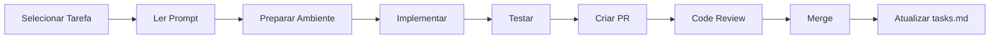

# Demandas e Tarefas - Construction Analysis AI System

Central de gerenciamento de demandas e prompts de desenvolvimento para o sistema de análise de construção com IA. Este diretório organiza todas as tarefas pendentes e seus respectivos prompts de implementação.

## Início Rápido
- **Nova demanda?** Use [modelo_prompt_task.md](modelo_prompt_task.md) como template
- **Verificar status?** Consulte [tasks.md](tasks.md) para lista completa
- **Implementar tarefa?** Siga o prompt específico da task

## Estrutura de Arquivos

### Documentos Base
- [modelo_prompt_task.md](modelo_prompt_task.md) — Template padrão para criar novos prompts de tarefas
- [tasks.md](tasks.md) — Lista mestre de todas as tarefas com status de conclusão

### Prompts de Tarefas Pendentes

#### Fase 3: Desenvolvimento de Features
- [task-10-chat-interface-api.md](task-10-chat-interface-api.md) — WebSocket API para chat em tempo real
- [task-11-minio-storage-integration.md](task-11-minio-storage-integration.md) — Integração completa com MinIO para storage
- [task-12-openrouter-fallback-system.md](task-12-openrouter-fallback-system.md) — Sistema de fallback inteligente com OpenRouter

## Status das Tarefas

### ✅ Tarefas Concluídas
- **Phase 1: Foundation (Tasks 1-3)** — Infraestrutura base completa
- **Phase 2: Core Implementation (Tasks 4-7)** — Agents principais implementados
  - Task 5: Supervisor Agent
  - Task 6: Visual Agent
  - Task 7: Document Agent
  - Task 8: Progress Agent (implementado em `backend/src/agents/progress_agent.py`)
  - Task 9: Report Agent (implementado em `backend/src/agents/report_agent.py`)

### 🚧 Tarefas Pendentes Prioritárias
| Task | Título | Prioridade | Prompt Disponível |
|------|--------|------------|-------------------|
| 10 | Chat Interface API | 🔴 Alta | ✅ [Disponível](task-10-chat-interface-api.md) |
| 11 | MinIO Storage Integration | 🔴 Alta | ✅ [Disponível](task-11-minio-storage-integration.md) |
| 12 | OpenRouter Fallback System | 🟡 Média | ✅ [Disponível](task-12-openrouter-fallback-system.md) |
| 13 | Frontend React Application | 🟡 Média | ⏳ Em elaboração |
| 14 | Testing Suite Implementation | 🟡 Média | ⏳ Em elaboração |
| 15 | Security Implementation | 🔴 Alta | ⏳ Em elaboração |

### 📋 Próximas Tarefas
- Tasks 16-20: Performance, Documentation, Deployment
- Tasks 21-22: Mobile/PWA Features
- Tasks 23-24: Bug Fixes e UI/UX Improvements

## Como Usar os Prompts

### Para Desenvolvedores
1. **Escolha uma tarefa** da lista de pendentes
2. **Abra o prompt correspondente** (ex: `task-10-chat-interface-api.md`)
3. **Siga as instruções** do prompt, começando pela seção "Start Here"
4. **Consulte os guias** referenciados no prompt
5. **Implemente seguindo** o escopo e requisitos definidos
6. **Valide com checklists** ao final do prompt

### Para Gerentes/Tech Leads
1. **Acompanhe o progresso** em [tasks.md](tasks.md)
2. **Priorize tarefas** baseado nas dependências
3. **Revise PRs** usando os entregáveis listados nos prompts
4. **Valide implementações** com os critérios de aceitação

## Estrutura de um Prompt

Cada prompt segue o modelo padrão com as seções:

```markdown
# Prompt: [Nome da Tarefa]

Start Here
- Referências aos guias e padrões do repositório

Objetivo
- Descrição clara do que deve ser implementado

Escopo
- Detalhamento dos componentes e funcionalidades

Requisitos de Configuração
- Dependências e variáveis de ambiente

Arquitetura de Alto Nível
- Visão geral da solução

Modelagem de Dados
- Schemas e estruturas de dados

APIs
- Endpoints e interfaces

Implementação
- Código exemplo e padrões

Testes
- Estratégia de testes

Entregáveis do PR
- Lista de verificação para o pull request

Checklists úteis
- Guias e validações importantes

Notas
- Considerações adicionais
```

## Workflow de Implementação



## Dependências Entre Tarefas

```
Foundation (1-3) ✅
    ↓
Core Agents (4-7) ✅
    ↓
Features (8-10) 🚧
    ├── Chat API (10) → Frontend (13)
    ├── Storage (11) → Reports (9) ✅
    └── OpenRouter (12) → All Agents
    ↓
QA & Security (14-16) ⏳
    ↓
Deployment (17-20) ⏳
```

## Convenções

### Status das Tarefas
- ✅ **Concluída** - Implementada e testada
- 🚧 **Em Progresso** - Desenvolvimento ativo
- ⏳ **Pendente** - Aguardando início
- 🔴 **Bloqueada** - Dependência não resolvida

### Prioridades
- 🔴 **Alta** - Crítico para o sistema
- 🟡 **Média** - Importante mas não bloqueante
- 🟢 **Baixa** - Nice to have

### Estimativas
- **S** - Small (1-2 dias)
- **M** - Medium (3-5 dias)
- **L** - Large (1-2 semanas)
- **XL** - Extra Large (2+ semanas)

## Criando Novos Prompts

Para adicionar uma nova demanda:

1. **Use o modelo**: Copie `modelo_prompt_task.md`
2. **Nomeie adequadamente**: `task-[número]-[nome-descritivo].md`
3. **Preencha todas as seções**: Seja específico e detalhado
4. **Adicione em tasks.md**: Atualize a lista mestre
5. **Atualize este README**: Adicione na seção apropriada

## Métricas de Progresso

### Sprint Atual
- **Tasks Concluídas**: 9/24 (37.5%)
- **Tasks em Progresso**: 3
- **Tasks Pendentes**: 12

### Velocity
- **Média por Sprint**: 4-5 tasks
- **Tempo médio por task**: 3 dias

## Links Importantes

### Documentação Principal
- [Central Docs](../README.md) — Índice principal da documentação
- [Architecture](../architecture.md) — Arquitetura do sistema
- [Development Guidelines](../development-guidelines.md) — Padrões de código

### Guias de Agents
- [AGENTS.md](../../AGENTS.md) — Guia principal de agents
- [AI Agents](../ai-agents.md) — Especificações técnicas
- [AI Agent Development](../ai-agent-development.md) — Como desenvolver agents

### Referências Técnicas
- [Backend Guide](../backend.md) — Desenvolvimento backend
- [Frontend Guide](../frontend.md) — Desenvolvimento frontend
- [API Documentation](../api.md) — Especificação das APIs
- [Database](../database.md) — Schemas MongoDB

## Suporte

Para dúvidas ou problemas:
1. Consulte a documentação relevante
2. Verifique os prompts de tarefas similares
3. Revise o código existente de tarefas concluídas
4. Contate o tech lead se necessário

---

*Última atualização: 2025-01-27*
*Mantenedor: Time de Desenvolvimento*