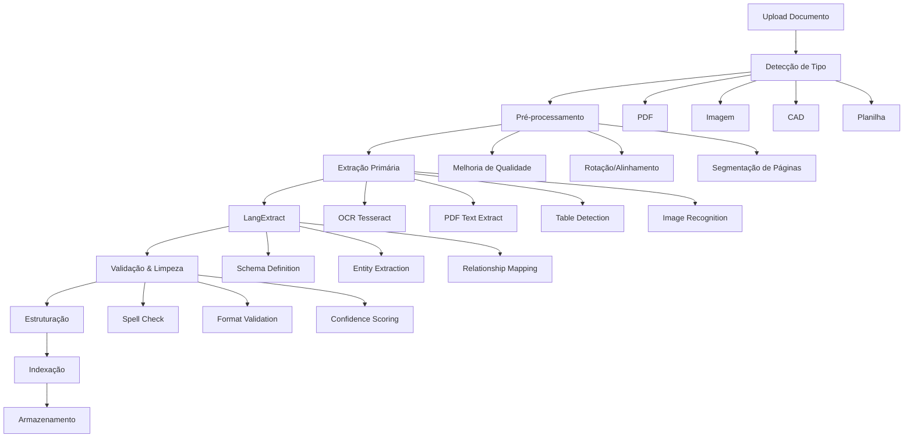

# 📄 Guia de Processamento de Documentos (OCR)

## 📋 Visão Geral

Sistema inteligente de processamento de documentos técnicos de engenharia civil, utilizando **LangExtract**, **OCR avançado** e **extração estruturada** para transformar documentos físicos em dados consultáveis.

---

## 🎯 Tipos de Documentos Suportados

### **1. Plantas Técnicas**
- **Formatos**: PDF, DWG, JPG, PNG
- **Conteúdo**: Plantas baixas, cortes, fachadas, detalhes
- **Extração**: Dimensões, cotas, especificações, legendas

### **2. Especificações Técnicas**
- **Formatos**: PDF, DOC, DOCX, TXT
- **Conteúdo**: Memorial descritivo, caderno de encargos
- **Extração**: Materiais, quantidades, normas, procedimentos

### **3. Cronogramas e Planilhas**
- **Formatos**: XLS, XLSX, PDF, CSV
- **Conteúdo**: Cronograma físico-financeiro, orçamentos
- **Extração**: Datas, atividades, recursos, custos

### **4. Relatórios e Laudos**
- **Formatos**: PDF, DOC, DOCX
- **Conteúdo**: Relatórios de progresso, laudos técnicos
- **Extração**: Resultados, recomendações, não-conformidades

---

## 🔧 Stack Tecnológico

### **LangExtract (Google)**
```python
import langextract as lx

# Configuração principal para documentos técnicos
result = lx.extract(
    text_or_documents="document.pdf",
    prompt_description="Extrair informações técnicas de engenharia",
    model_id="gemini-2.0-flash-exp",
    extraction_passes=3,
    max_workers=10,
    max_char_buffer=2000
)
```

### **Tesseract OCR**
```python
import pytesseract
from PIL import Image

# Configuração otimizada para plantas técnicas
custom_config = r'--oem 3 --psm 6 -c tessedit_char_whitelist=0123456789ABCDEFGHIJKLMNOPQRSTUVWXYZabcdefghijklmnopqrstuvwxyz.,-+=/() '
text = pytesseract.image_to_string(image, config=custom_config)
```

### **PyPDF2 + PDFPlumber**
```python
import pdfplumber
import PyPDF2

# Extração híbrida: texto + tabelas + metadados
with pdfplumber.open("document.pdf") as pdf:
    for page in pdf.pages:
        text = page.extract_text()
        tables = page.extract_tables()
        metadata = page.metadata
```

---

## 📊 Pipeline de Processamento

### **Fluxo Principal**



### **Schemas de Extração**

#### **Schema para Plantas Técnicas**
```python
PLANT_SCHEMA = {
    "type": "object",
    "properties": {
        "project_info": {
            "type": "object",
            "properties": {
                "project_name": {"type": "string"},
                "drawing_number": {"type": "string"},
                "scale": {"type": "string"},
                "date": {"type": "string"},
                "revision": {"type": "string"},
                "responsible_engineer": {"type": "string"}
            }
        },
        "dimensions": {
            "type": "array",
            "items": {
                "type": "object",
                "properties": {
                    "element": {"type": "string"},
                    "measurement": {"type": "number"},
                    "unit": {"type": "string"},
                    "location": {"type": "string"}
                }
            }
        },
        "materials": {
            "type": "array",
            "items": {
                "type": "object",
                "properties": {
                    "material_name": {"type": "string"},
                    "specification": {"type": "string"},
                    "quantity": {"type": "number"},
                    "unit": {"type": "string"},
                    "location": {"type": "string"}
                }
            }
        },
        "rooms": {
            "type": "array",
            "items": {
                "type": "object",
                "properties": {
                    "room_name": {"type": "string"},
                    "area": {"type": "number"},
                    "function": {"type": "string"},
                    "level": {"type": "string"}
                }
            }
        }
    }
}
```

#### **Schema para Cronogramas**
```python
SCHEDULE_SCHEMA = {
    "type": "object",
    "properties": {
        "project_header": {
            "type": "object",
            "properties": {
                "project_name": {"type": "string"},
                "start_date": {"type": "string"},
                "end_date": {"type": "string"},
                "total_duration": {"type": "number"},
                "contractor": {"type": "string"}
            }
        },
        "activities": {
            "type": "array",
            "items": {
                "type": "object",
                "properties": {
                    "activity_id": {"type": "string"},
                    "activity_name": {"type": "string"},
                    "start_date": {"type": "string"},
                    "end_date": {"type": "string"},
                    "duration": {"type": "number"},
                    "predecessors": {"type": "array"},
                    "resources": {"type": "array"},
                    "progress_percentage": {"type": "number"},
                    "cost": {"type": "number"}
                }
            }
        },
        "milestones": {
            "type": "array",
            "items": {
                "type": "object",
                "properties": {
                    "milestone_name": {"type": "string"},
                    "date": {"type": "string"},
                    "description": {"type": "string"},
                    "critical": {"type": "boolean"}
                }
            }
        }
    }
}
```

#### **Schema para Especificações**
```python
SPECIFICATION_SCHEMA = {
    "type": "object",
    "properties": {
        "document_info": {
            "type": "object",
            "properties": {
                "title": {"type": "string"},
                "version": {"type": "string"},
                "date": {"type": "string"},
                "author": {"type": "string"}
            }
        },
        "materials_specs": {
            "type": "array",
            "items": {
                "type": "object",
                "properties": {
                    "material": {"type": "string"},
                    "specification": {"type": "string"},
                    "norm_reference": {"type": "string"},
                    "quality_class": {"type": "string"},
                    "supplier_requirements": {"type": "string"}
                }
            }
        },
        "procedures": {
            "type": "array",
            "items": {
                "type": "object",
                "properties": {
                    "activity": {"type": "string"},
                    "procedure": {"type": "string"},
                    "tools_required": {"type": "array"},
                    "quality_control": {"type": "string"},
                    "safety_requirements": {"type": "string"}
                }
            }
        },
        "quality_standards": {
            "type": "array",
            "items": {
                "type": "object",
                "properties": {
                    "standard_name": {"type": "string"},
                    "requirement": {"type": "string"},
                    "test_method": {"type": "string"},
                    "acceptance_criteria": {"type": "string"}
                }
            }
        }
    }
}
```

---

## 🎯 Prompts Especializados

### **Prompt para Plantas Técnicas**
```
Você é um especialista em leitura e interpretação de plantas técnicas de engenharia civil.

Analise o documento fornecido e extraia:

1. **Informações do Projeto**:
   - Nome do projeto
   - Número da prancha
   - Escala utilizada
   - Data e revisão
   - Responsável técnico

2. **Dimensões e Cotas**:
   - Todas as dimensões indicadas
   - Elementos estruturais (vigas, pilares, lajes)
   - Medidas de ambientes
   - Especificações de aberturas

3. **Materiais Especificados**:
   - Tipos de materiais indicados
   - Especificações técnicas
   - Quantidades quando disponíveis
   - Localizações específicas

4. **Layout e Ambientes**:
   - Nome dos ambientes
   - Áreas calculadas
   - Função de cada espaço
   - Nível/pavimento

IMPORTANTE:
- Use apenas informações explicitamente presentes no documento
- Indique o nível de confiança para cada extração
- Mantenha unidades de medida originais
- Preserve numeração e códigos técnicos
```

### **Prompt para Cronogramas**
```
Você é um especialista em análise de cronogramas de obras e gestão de projetos.

Analise o cronograma fornecido e extraia:

1. **Cabeçalho do Projeto**:
   - Nome da obra
   - Datas de início e fim
   - Duração total
   - Empresa executora
   - Responsável pelo cronograma

2. **Atividades do Cronograma**:
   - Código/ID da atividade
   - Descrição detalhada
   - Data de início planejada
   - Data de fim planejada
   - Duração em dias
   - Predecessoras/dependências
   - Recursos necessários
   - % de progresso atual
   - Valores orçados

3. **Marcos (Milestones)**:
   - Nome do marco
   - Data prevista
   - Descrição/critério
   - Indicação se é crítico

4. **Observações Especiais**:
   - Restrições identificadas
   - Riscos mencionados
   - Premissas assumidas
   - Critérios de qualidade

DIRETRIZES:
- Mantenha sequência cronológica
- Preserve códigos de atividade originais
- Identifique caminho crítico quando possível
- Extraia valores monetários com moeda original
```

### **Prompt para Especificações**
```
Você é um especialista em especificações técnicas e normas de construção civil.

Analise o documento de especificações e extraia:

1. **Metadados do Documento**:
   - Título e versão
   - Data de elaboração
   - Autor/responsável
   - Projeto associado

2. **Especificações de Materiais**:
   - Nome do material
   - Especificação técnica detalhada
   - Normas técnicas aplicáveis (NBR, ASTM, etc.)
   - Classe de qualidade
   - Requisitos de fornecedor

3. **Procedimentos Executivos**:
   - Atividade/serviço
   - Procedimento passo-a-passo
   - Ferramentas necessárias
   - Controle de qualidade
   - Requisitos de segurança

4. **Normas e Padrões**:
   - Nome da norma
   - Requisito específico
   - Método de teste/verificação
   - Critério de aceitação

ATENÇÃO:
- Preserve códigos de normas técnicas exatos
- Mantenha especificações técnicas completas
- Identifique requisitos obrigatórios vs opcionais
- Extraia tolerâncias e limites quando especificados
```

---

## 🔍 Processamento Avançado

### **1. Otimização de Imagem**
```python
def enhance_technical_document(image_path: str) -> np.ndarray:
    """
    Melhora qualidade de plantas técnicas escaneadas
    """
    import cv2
    import numpy as np

    # Carregar imagem
    img = cv2.imread(image_path, cv2.IMREAD_GRAYSCALE)

    # Redução de ruído
    denoised = cv2.fastNlMeansDenoising(img)

    # Melhoria de contraste
    clahe = cv2.createCLAHE(clipLimit=2.0, tileGridSize=(8,8))
    enhanced = clahe.apply(denoised)

    # Binarização adaptativa
    binary = cv2.adaptiveThreshold(
        enhanced, 255, cv2.ADAPTIVE_THRESH_GAUSSIAN_C,
        cv2.THRESH_BINARY, 11, 2
    )

    # Operações morfológicas para limpeza
    kernel = np.ones((2,2), np.uint8)
    cleaned = cv2.morphologyEx(binary, cv2.MORPH_CLOSE, kernel)

    return cleaned
```

### **2. Detecção de Tabelas**
```python
def extract_tables_from_pdf(pdf_path: str) -> List[pd.DataFrame]:
    """
    Extrai tabelas estruturadas de PDFs técnicos
    """
    import camelot

    # Extração automática de tabelas
    tables = camelot.read_pdf(pdf_path, pages='all', flavor='lattice')

    # Processamento e limpeza
    processed_tables = []
    for table in tables:
        df = table.df

        # Limpeza de cabeçalhos vazios
        df = df.dropna(how='all', axis=0)
        df = df.dropna(how='all', axis=1)

        # Inferência de tipos de dados
        df = df.apply(pd.to_numeric, errors='ignore')

        processed_tables.append(df)

    return processed_tables
```

### **3. Validação de Confiança**
```python
def calculate_extraction_confidence(extracted_data: dict, original_text: str) -> float:
    """
    Calcula confiança da extração baseada em múltiplos fatores
    """
    confidence_factors = []

    # Fator 1: Coverage (% do texto original coberto)
    coverage = len(str(extracted_data)) / len(original_text)
    confidence_factors.append(min(coverage * 100, 100))

    # Fator 2: Schema compliance
    required_fields = ["project_info", "dimensions", "materials"]
    schema_compliance = sum(1 for field in required_fields if field in extracted_data) / len(required_fields)
    confidence_factors.append(schema_compliance * 100)

    # Fator 3: Data quality (presença de valores numéricos válidos)
    numeric_accuracy = validate_numeric_fields(extracted_data)
    confidence_factors.append(numeric_accuracy)

    # Fator 4: Technical terms recognition
    technical_terms_score = count_technical_terms(extracted_data)
    confidence_factors.append(technical_terms_score)

    return sum(confidence_factors) / len(confidence_factors)
```

---

## 📋 Casos de Uso Práticos

### **Caso 1: Análise de Planta Baixa**
```python
# Upload da planta
result = await document_agent.process_document(
    file_path="planta_pavimento_tipo.pdf",
    document_type="technical_drawing"
)

# Extração estruturada
extracted = {
    "project_info": {
        "project_name": "Edifício Residencial Torres",
        "drawing_number": "PB-02",
        "scale": "1:50",
        "date": "15/01/2025"
    },
    "rooms": [
        {"name": "Sala", "area": 25.5, "function": "Social"},
        {"name": "Cozinha", "area": 12.0, "function": "Serviço"},
        {"name": "Dormitório 1", "area": 14.8, "function": "Íntimo"}
    ],
    "dimensions": [
        {"element": "Vão de porta sala", "measurement": 80, "unit": "cm"},
        {"element": "Pé-direito", "measurement": 280, "unit": "cm"}
    ]
}
```

### **Caso 2: Processamento de Cronograma**
```python
# Upload do cronograma
result = await document_agent.process_document(
    file_path="cronograma_fisico_financeiro.xlsx",
    document_type="schedule"
)

# Atividades extraídas
activities = [
    {
        "id": "001",
        "name": "Escavação e movimento de terra",
        "start_date": "2025-02-01",
        "duration": 15,
        "progress": 0,
        "cost": 45000.00
    },
    {
        "id": "002",
        "name": "Fundações - estacas",
        "start_date": "2025-02-16",
        "duration": 20,
        "predecessors": ["001"],
        "cost": 120000.00
    }
]
```

---

## 🎯 Métricas de Qualidade

### **KPIs de Performance**
- **Precisão OCR**: >95% em documentos técnicos limpos
- **Taxa de Extração**: >90% dos campos obrigatórios
- **Tempo de Processamento**: <30s para documentos de até 50 páginas
- **Confiabilidade**: Score médio de confiança >85%

### **Validação Contínua**
- Validação manual de amostras (10% dos documentos)
- Feedback de usuários para refinamento
- A/B testing de diferentes prompts
- Monitoramento de degradação de performance

---

**📝 Nota**: Este sistema de OCR é otimizado especificamente para documentos técnicos de engenharia civil, proporcionando alta precisão na extração de informações críticas para análise de projetos.