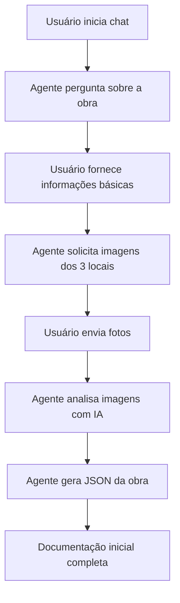
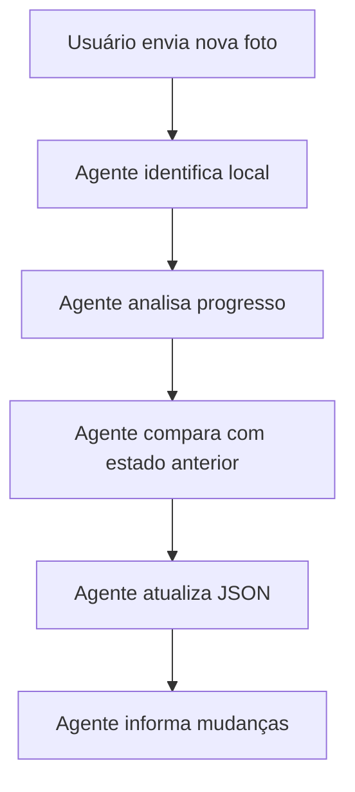

# 📋 PRD MVP - Agente Conversacional de Obras

## 🎯 Visão Simplificada

**MVP Focado**: Agente conversacional inteligente que documenta obras através de chat interativo, análise de imagens e geração automática de documentação estruturada em JSON.

---

## 🎯 Objetivo Principal

Criar um **agente conversacional** que:

1. **Entrevista** o usuário sobre a obra via chat
2. **Analisa imagens** enviadas pelo usuário
3. **Documenta tudo** em arquivo JSON estruturado
4. **Monitora 3 locais específicos** da obra
5. **Atualiza status** conforme progresso

---

## 🏗️ Fluxo Principal do MVP

### **Fase 1: Documentação Inicial**


### **Fase 2: Monitoramento Contínuo**


---

## 🤖 Configuração do Agente (JSON)

### **Arquivo: `agent_config.json`**
```json
{
  "agent_metadata": {
    "name": "Agente de Obras",
    "version": "1.0.0",
    "description": "Agente conversacional para documentação e monitoramento de obras",
    "created_at": "2025-01-15"
  },

  "model_config": {
    "provider": "openai",
    "model": "gpt-4-vision-preview",
    "temperature": 0.3,
    "max_tokens": 2048,
    "vision_enabled": true
  },

  "locations": {
    "location_1": {
      "name": "Área Externa - Fachada",
      "description": "Fachada principal e área externa da construção",
      "key_elements": ["estrutura", "revestimento", "esquadrias"],
      "tracking_phases": ["fundação", "estrutura", "alvenaria", "acabamento"]
    },
    "location_2": {
      "name": "Área Interna - Sala Principal",
      "description": "Ambiente interno principal da obra",
      "key_elements": ["piso", "paredes", "teto", "instalações"],
      "tracking_phases": ["estrutura", "alvenaria", "instalações", "acabamento"]
    },
    "location_3": {
      "name": "Área Técnica - Cozinha/Banheiro",
      "description": "Áreas molhadas e instalações técnicas",
      "key_elements": ["hidraulica", "eletrica", "revestimentos", "louças"],
      "tracking_phases": ["instalações", "impermeabilização", "revestimento", "louças"]
    }
  },

  "construction_phases": {
    "fundacao": {
      "name": "Fundação",
      "description": "Escavação, ferragem e concretagem da fundação",
      "visual_indicators": ["terra escavada", "ferragem exposta", "concreto fresco"],
      "completion_criteria": "Fundação concretada e curada"
    },
    "estrutura": {
      "name": "Estrutura",
      "description": "Pilares, vigas e lajes estruturais",
      "visual_indicators": ["pilares de concreto", "vigas", "lajes", "ferragem"],
      "completion_criteria": "Estrutura completa e desformada"
    },
    "alvenaria": {
      "name": "Alvenaria",
      "description": "Paredes de vedação e divisórias",
      "visual_indicators": ["tijolos", "blocos", "argamassa", "paredes levantadas"],
      "completion_criteria": "Todas as paredes levantadas"
    },
    "instalacoes": {
      "name": "Instalações",
      "description": "Instalações elétricas, hidráulicas e complementares",
      "visual_indicators": ["tubulações", "fiação", "caixas elétricas", "registros"],
      "completion_criteria": "Instalações testadas e funcionais"
    },
    "acabamento": {
      "name": "Acabamento",
      "description": "Revestimentos, pintura e acabamentos finais",
      "visual_indicators": ["reboco", "pintura", "pisos", "azulejos"],
      "completion_criteria": "Acabamentos finais concluídos"
    }
  },

  "prompts": {
    "initial_interview": {
      "system_prompt": "Você é um especialista em obras e construção civil. Sua função é documentar uma obra através de perguntas estruturadas e análise de imagens. Seja amigável, técnico e objetivo. Sempre mantenha o contexto da conversa.",

      "questions_sequence": [
        "Olá! Sou seu agente de documentação de obras. Vamos começar! Qual é o nome ou identificação desta obra?",
        "Que tipo de construção estamos acompanhando? (residencial, comercial, industrial, reforma, etc.)",
        "Qual é o endereço ou localização da obra?",
        "Quem é o responsável técnico pela obra? (engenheiro, arquiteto, mestre de obras)",
        "Qual a data de início prevista ou já iniciada?",
        "Qual a previsão de conclusão da obra?",
        "Agora preciso de fotos dos 3 locais principais. Vou solicitar uma de cada vez. Pode enviar uma foto da ÁREA EXTERNA/FACHADA?",
        "Perfeito! Agora uma foto da ÁREA INTERNA PRINCIPAL (sala, ambiente principal)?",
        "Ótimo! Por último, uma foto da ÁREA TÉCNICA (cozinha, banheiro ou área de instalações)?",
        "Excelente! Analisei tudo e criei a documentação inicial da obra. Vou mostrar o resumo..."
      ]
    },

    "image_analysis": {
      "system_prompt": "Analise esta imagem de construção civil e identifique: 1) Fase construtiva atual, 2) Elementos visíveis na obra, 3) Estimativa de progresso (%), 4) Observações técnicas importantes. Seja preciso e técnico.",

      "analysis_template": {
        "location": "identificar qual dos 3 locais",
        "current_phase": "fase construtiva identificada",
        "progress_percentage": "estimativa 0-100%",
        "elements_detected": ["lista de elementos visíveis"],
        "quality_observations": "observações sobre qualidade",
        "next_steps": "próximas etapas recomendadas",
        "confidence_score": "confiança da análise 0-100%"
      }
    },

    "progress_update": {
      "system_prompt": "Compare o estado atual com o estado anterior e identifique mudanças no progresso da obra. Seja objetivo sobre o que mudou.",

      "update_template": {
        "changes_detected": ["lista de mudanças"],
        "progress_delta": "mudança percentual",
        "new_phase_detected": "nova fase se aplicável",
        "timeline_impact": "impacto no cronograma",
        "recommendations": "recomendações baseadas na evolução"
      }
    }
  },

  "output_format": {
    "project_json_structure": {
      "project_info": {
        "project_name": "",
        "project_type": "",
        "address": "",
        "responsible_engineer": "",
        "start_date": "",
        "expected_completion": "",
        "created_at": "",
        "last_updated": ""
      },

      "locations_status": {
        "location_1": {
          "current_phase": "",
          "progress_percentage": 0,
          "last_photo_date": "",
          "elements_detected": [],
          "observations": "",
          "next_milestone": ""
        },
        "location_2": {
          "current_phase": "",
          "progress_percentage": 0,
          "last_photo_date": "",
          "elements_detected": [],
          "observations": "",
          "next_milestone": ""
        },
        "location_3": {
          "current_phase": "",
          "progress_percentage": 0,
          "last_photo_date": "",
          "elements_detected": [],
          "observations": "",
          "next_milestone": ""
        }
      },

      "timeline": [
        {
          "date": "",
          "location": "",
          "event": "",
          "phase": "",
          "progress": 0,
          "photos": []
        }
      ],

      "overall_progress": {
        "total_progress_percentage": 0,
        "current_main_phase": "",
        "estimated_completion": "",
        "delays_identified": [],
        "recommendations": []
      }
    }
  }
}
```

---

## 🗣️ Conversas Exemplo

### **Conversa 1: Documentação Inicial**
```
🤖 Agente: Olá! Sou seu agente de documentação de obras. Vamos começar!
           Qual é o nome ou identificação desta obra?

👤 Usuário: Casa da Maria Silva - Ampliação cozinha

🤖 Agente: Perfeito! Que tipo de construção estamos acompanhando?
           (residencial, comercial, industrial, reforma, etc.)

👤 Usuário: É uma reforma residencial, ampliação da cozinha

🤖 Agente: Entendi! Qual é o endereço ou localização da obra?

👤 Usuário: Rua das Flores, 123 - São Paulo/SP

🤖 Agente: Quem é o responsável técnico pela obra?

👤 Usuário: Eng. João Santos - CREA 123456

🤖 Agente: Qual a data de início prevista ou já iniciada?

👤 Usuário: Começou dia 10/01/2025

🤖 Agente: Qual a previsão de conclusão da obra?

👤 Usuário: 30 dias, então até 10/02/2025

🤖 Agente: Perfeito! Agora preciso de fotos dos 3 locais principais.
           Pode enviar uma foto da ÁREA EXTERNA onde será a ampliação?

👤 Usuário: [ANEXA FOTO]

🤖 Agente: Analisando a imagem...
           ✅ Identifico: Área externa com fundação iniciada
           ✅ Fase atual: Fundação (30% concluída)
           ✅ Elementos: Escavação feita, ferragem posicionada

           Agora uma foto da ÁREA INTERNA da cozinha atual?

👤 Usuário: [ANEXA FOTO]

🤖 Agente: Perfeito! Vejo a cozinha atual que será ampliada.
           ✅ Estado: Cozinha original preservada
           ✅ Preparada para integração com ampliação

           Por último, uma foto da ÁREA DE INSTALAÇÕES (onde passarão
           as tubulações da nova cozinha)?

👤 Usuário: [ANEXA FOTO]

🤖 Agente: Excelente! Criei a documentação completa da obra:

📋 **RESUMO DA OBRA DOCUMENTADA:**
- **Projeto**: Casa da Maria Silva - Ampliação cozinha
- **Tipo**: Reforma residencial
- **Responsável**: Eng. João Santos
- **Período**: 10/01/2025 a 10/02/2025 (30 dias)

📍 **STATUS DOS 3 LOCAIS:**
1. **Área Externa**: Fundação 30% - Ferragem posicionada
2. **Área Interna**: Preservada - Aguardando integração
3. **Área Técnica**: Preparada - Instalações a definir

📊 **Progresso Geral**: 15% concluído
🎯 **Próxima Etapa**: Concretagem da fundação

✅ Documentação salva em: `obra_maria_silva_20250115.json`

A partir de agora, sempre que enviar novas fotos, vou atualizar
automaticamente o progresso da obra!
```

### **Conversa 2: Atualização de Progresso**
```
👤 Usuário: [ANEXA NOVA FOTO]

🤖 Agente: Analisando nova imagem...

🔍 **ANÁLISE CONCLUÍDA:**
- **Local identificado**: Área Externa (Local 1)
- **Mudança detectada**: Fundação concretada! ✅
- **Progresso anterior**: 30% → **Novo progresso**: 70%
- **Nova fase**: Aguardando cura do concreto

📈 **ATUALIZAÇÃO DO PROGRESSO:**
- **Progresso geral da obra**: 15% → **25%**
- **Cronograma**: No prazo ✅
- **Próxima etapa**: Início da estrutura (pilares)

**Recomendação**: Aguardar 7 dias para cura completa antes
de iniciar a estrutura dos pilares.

✅ Documentação atualizada em: `obra_maria_silva_20250115.json`

Quer que eu analise algum outro local ou tem alguma pergunta
sobre o progresso?
```

---

## 🎯 Funcionalidades do MVP

### **✅ Core Features**

1. **Chat Conversacional Estruturado**
   - Sequência de perguntas pré-definidas
   - Contexto mantido durante toda conversa
   - Linguagem técnica mas acessível

2. **Análise de Imagens com IA**
   - Detecção de fases construtivas
   - Identificação de elementos da obra
   - Estimativa de progresso percentual
   - Avaliação de qualidade visual

3. **Documentação JSON Automática**
   - Estrutura padronizada para todas as obras
   - Atualização em tempo real
   - Histórico completo de mudanças
   - Exportação facilitada

4. **Monitoramento de 3 Locais**
   - Local 1: Área Externa/Fachada
   - Local 2: Área Interna Principal
   - Local 3: Área Técnica/Instalações
   - Progresso independente por local

5. **Sistema de Configuração**
   - Prompts centralizados em JSON
   - Fases construtivas configuráveis
   - Locais personalizáveis por obra
   - Modelos de IA ajustáveis

### **⏳ Fora do Escopo (V1)**
- Integração BIM complexa
- Múltiplas obras simultâneas
- Relatórios em PDF
- Dashboard web elaborado
- Cronograma automático

---

## 🛠️ Arquitetura Técnica Simplificada

### **Stack MVP**
```yaml
Backend:
  - FastAPI (Python)
  - LangChain + OpenRouter (Grok-4 Fast chat + Gemini 2.5 Flash visão)
  - JSON file storage (sem banco inicialmente)
  - Upload de imagens local

Frontend:
  - React simples
  - Chat interface
  - Upload de fotos
  - Visualização JSON

Deploy:
  - Railway (1 serviço apenas)
  - Armazenamento em volume
```

### **Estrutura de Arquivos**
```
/backend
├── main.py                 # FastAPI app
├── agent/
│   ├── conversational_agent.py   # Agente principal
│   ├── image_analyzer.py         # Análise de imagens
│   └── config_loader.py          # Carrega agent_config.json
├── storage/
│   ├── projects/              # JSONs das obras
│   └── images/               # Fotos enviadas
└── config/
    └── agent_config.json    # Configuração central

/frontend
├── src/
│   ├── components/
│   │   ├── Chat.jsx
│   │   ├── ImageUpload.jsx
│   │   └── ProjectStatus.jsx
│   └── App.jsx
```

---

## 📊 Métricas de Sucesso MVP

### **Funcionalidade**
- ✅ Documentar 1 obra completa em <10 minutos
- ✅ Análise de imagem em <5 segundos
- ✅ Precisão >80% na identificação de fases
- ✅ JSON estruturado gerado automaticamente

### **Experiência do Usuário**
- ✅ Conversa fluida e natural
- ✅ Interface simples e intuitiva
- ✅ Feedback visual em tempo real
- ✅ Zero configuração manual

### **Técnica**
- ✅ Tempo de resposta <3s
- ✅ Upload de imagens funcionando
- ✅ Configuração JSON carregando corretamente
- ✅ Deploy estável no Railway

---

## 🚀 Roadmap de Desenvolvimento

### **Sprint 1 (Semana 1): Base**
- [ ] Setup FastAPI + LangChain
- [ ] Carregamento de `agent_config.json`
- [ ] Chat básico funcionando
- [ ] Upload de imagens

### **Sprint 2 (Semana 2): IA**
- [ ] Integração OpenAI Vision
- [ ] Análise de imagens de obras
- [ ] Geração de JSON estruturado
- [ ] Sequência de perguntas

### **Sprint 3 (Semana 3): Frontend**
- [ ] Interface React do chat
- [ ] Visualização do JSON gerado
- [ ] Upload drag-and-drop
- [ ] Status dos 3 locais

### **Sprint 4 (Semana 4): Deploy**
- [ ] Deploy no Railway
- [ ] Testes end-to-end
- [ ] Documentação de uso
- [ ] MVP pronto para uso

---

**🎯 Objetivo**: MVP funcional em 4 semanas, focado na experiência conversacional e documentação automática de obras através de análise inteligente de imagens.**