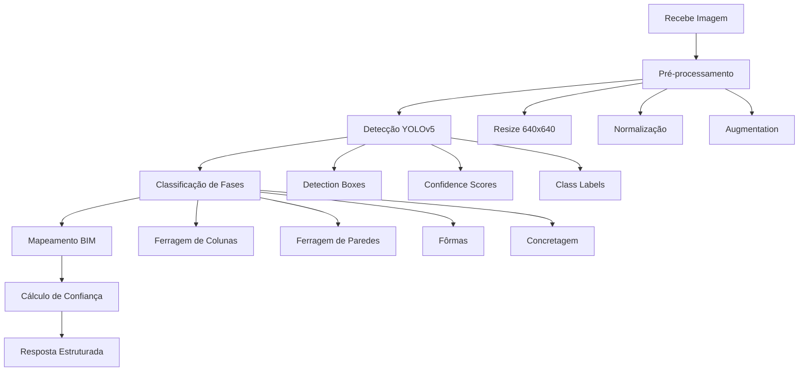

# 🤖 Documentação de Agentes - Comportamentos e Fluxos

## 📋 Visão Geral dos Agentes

O sistema é composto por **4 agentes especializados** que trabalham de forma coordenada através do **LangGraph** para fornecer análises inteligentes de projetos de engenharia civil.

---

## 🎯 Orquestrador Principal

### **SupervisorAgent**
**Função**: Coordena e distribui tarefas entre os agentes especializados

```python
class SupervisorAgent:
    def __init__(self):
        self.agents = {
            "visual": VisualAgent(),
            "documentation": DocumentationAgent(),
            "progress": ProgressAgent(),
            "reports": ReportsAgent()
        }

    async def route_message(self, message: str, attachments: List) -> str:
        # Analisa o input e determina qual(is) agente(s) deve(m) responder
        # Coordena fluxo de trabalho entre múltiplos agentes se necessário
```

**Responsabilidades**:
- Análise de intent do usuário
- Roteamento para agentes apropriados
- Coordenação de fluxos multi-agente
- Consolidação de respostas
- Controle de qualidade das saídas

---

## 👁️ Agente Visual (Computer Vision)

### **Especialização**
Análise de imagens e vídeos de construção para identificação automática de progresso e elementos construtivos.

### **Tecnologias Core**
- **YOLOv5** com **CSPDarknet53** (detecção de objetos)
- **OpenAI Vision API** (análise semântica)
- **OpenCV** (pré-processamento)
- **Transfer Learning** com dataset MS COCO

### **Fluxo de Processamento**



### **Classes de Detecção**
```python
CONSTRUCTION_PHASES = {
    "rebar_column": "Amarração de ferragem - Colunas",
    "rebar_wall_pre": "Pré-amarração de ferragem - Paredes",
    "rebar_wall_complete": "Ferragem completa - Paredes",
    "formwork_wall": "Montagem de fôrmas - Paredes",
    "formwork_column": "Montagem de fôrmas - Colunas",
    "concrete_pouring": "Concretagem"
}
```

### **Capabilities**

#### 1. **Detecção Multi-Fase**
```python
async def detect_construction_phase(self, image_path: str) -> DetectionResult:
    """
    Detecta fase construtiva atual baseada na imagem

    Returns:
        DetectionResult com:
        - phase: Fase identificada
        - confidence: Score de confiança (0-1)
        - bounding_boxes: Coordenadas dos objetos detectados
        - metadata: Informações adicionais (área, qualidade, etc.)
    """
```

#### 2. **Análise Multi-Câmera**
```python
async def analyze_multiple_views(self, images: List[str], positions: List[Position]) -> MultiViewResult:
    """
    Processa múltiplas câmeras da mesma área para consenso

    Strategies:
    - Highest confidence: Usa detecção com maior confiança
    - Majority vote: Usa fase mais detectada
    - Progressive: Considera sequência temporal
    """
```

#### 3. **Mapeamento Espacial**
```python
async def map_to_bim_component(self, detection: DetectionResult, camera_position: Position) -> BIMMapping:
    """
    Mapeia detecções 2D para componentes 3D do modelo BIM
    Utiliza Unity Physic.Raycast para projeção espacial
    """
```

### **Prompts e Contexto**

#### **System Prompt**
```
Você é um especialista em análise visual de construção civil. Sua função é:

1. Analisar imagens de obras e identificar fases construtivas
2. Detectar elementos como ferragem, fôrmas e concretagem
3. Avaliar qualidade visual dos trabalhos executados
4. Mapear achados para componentes específicos da obra

Sempre forneça:
- Fase construtiva identificada
- Nível de confiança da análise
- Observações sobre qualidade
- Recomendações se aplicável

Seja preciso, técnico mas didático em suas explicações.
```

#### **Few-Shot Examples**
```
Human: [Imagem de coluna com ferragem exposta]
Assistant:
**Análise Visual Detectada:**
- **Fase**: Amarração de ferragem - Colunas
- **Confiança**: 87%
- **Observações**: Ferragem #12.5mm com espaçamento regular de 15cm
- **Qualidade**: Conforme NBR 6118 - amarração adequada
- **Próximos passos**: Pronto para montagem de fôrmas