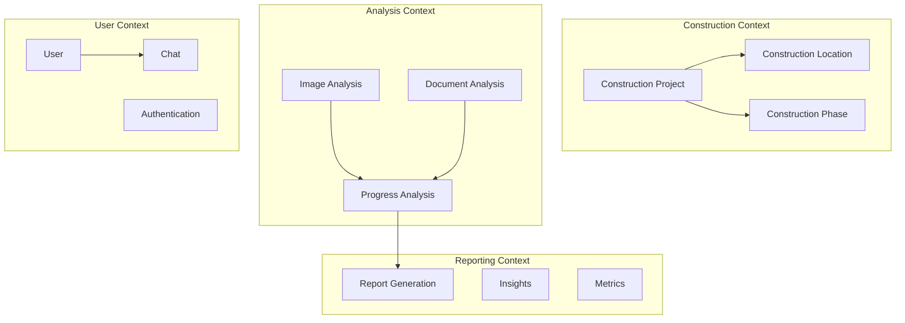

# 🏗️ Arquitetura Completa - Sistema de Agentes de Engenharia

## 📋 Visão Geral da Arquitetura

Sistema baseado em **Domain-Driven Design (DDD)**, princípios **SOLID** e metodologia **Scrum** para desenvolvimento de agentes inteligentes de análise de obras.

---

## 🎯 Princípios Arquiteturais

### **SOLID Principles**

#### **S - Single Responsibility Principle (SRP)**
Cada agente tem uma única responsabilidade bem definida:
- `VisualAgent`: Apenas análise de imagens
- `DocumentAgent`: Apenas processamento de documentos
- `ProgressAgent`: Apenas monitoramento de progresso
- `ReportAgent`: Apenas geração de relatórios

#### **O - Open/Closed Principle (OCP)**
Sistema extensível sem modificar código existente:
- Novos agentes podem ser adicionados via interface `IAgent`
- Novos processadores via estratégia pattern
- Novos formatos de output via adapters

#### **L - Liskov Substitution Principle (LSP)**
Todos os agentes implementam interface base `IAgent`:
```python
class IAgent(ABC):
    @abstractmethod
    async def process(self, input_data: Dict) -> AgentResponse:
        pass
```

#### **I - Interface Segregation Principle (ISP)**
Interfaces específicas por domínio:
- `IImageAnalyzer` para análise visual
- `IDocumentProcessor` para documentos
- `IProgressTracker` para progresso
- `IReportGenerator` para relatórios

#### **D - Dependency Inversion Principle (DIP)**
Dependências via abstração:
- Agentes dependem de interfaces, não implementações
- Injeção de dependências via construtor
- Configuração externa via JSON

---

## 🏛️ Domain-Driven Design (DDD)

### **Bounded Contexts**



### **Aggregates**

#### **Project Aggregate (Root)**
```python
class Project:
    def __init__(self):
        self.id: UUID
        self.info: ProjectInfo
        self.locations: List[Location]
        self.timeline: Timeline
        self.progress: Progress

    def add_location(self, location: Location):
        # Business rule: Max 3 locations
        if len(self.locations) >= 3:
            raise DomainException("Maximum 3 locations allowed")
        self.locations.append(location)
```

#### **Location Aggregate**
```python
class Location:
    def __init__(self):
        self.id: str
        self.name: str
        self.current_phase: Phase
        self.progress_percentage: int
        self.photos: List[Photo]

    def update_progress(self, new_progress: int):
        # Business rule: Progress only increases
        if new_progress < self.progress_percentage:
            raise DomainException("Progress cannot decrease")
        self.progress_percentage = new_progress
```

### **Value Objects**

```python
@dataclass(frozen=True)
class ProjectInfo:
    name: str
    type: ProjectType
    address: str
    responsible_engineer: str
    start_date: date
    expected_completion: date

@dataclass(frozen=True)
class Phase:
    name: str
    description: str
    visual_indicators: List[str]
    completion_criteria: str

@dataclass(frozen=True)
class Progress:
    percentage: int
    phase: Phase
    quality_score: int
    observations: str
```

### **Domain Events**

```python
class DomainEvent(ABC):
    timestamp: datetime
    aggregate_id: UUID

class ProjectCreated(DomainEvent):
    project_info: ProjectInfo

class LocationPhotoAdded(DomainEvent):
    location_id: str
    photo_path: str
    analysis_result: Dict

class ProgressUpdated(DomainEvent):
    location_id: str
    old_progress: int
    new_progress: int

class PhaseCompleted(DomainEvent):
    location_id: str
    completed_phase: Phase
    next_phase: Phase
```

---

## 🔧 Camadas da Arquitetura (Clean Architecture)

### **1. Domain Layer (Core)**
```
domain/
├── entities/
│   ├── project.py
│   ├── location.py
│   ├── phase.py
│   └── timeline.py
├── value_objects/
│   ├── project_info.py
│   ├── progress.py
│   └── photo.py
├── events/
│   ├── project_events.py
│   └── location_events.py
├── exceptions/
│   └── domain_exceptions.py
└── specifications/
    ├── project_specs.py
    └── location_specs.py
```

### **2. Application Layer (Use Cases)**
```
application/
├── use_cases/
│   ├── create_project/
│   │   ├── create_project_use_case.py
│   │   ├── create_project_dto.py
│   │   └── create_project_validator.py
│   ├── analyze_image/
│   │   ├── analyze_image_use_case.py
│   │   ├── analyze_image_dto.py
│   │   └── image_analysis_service.py
│   ├── update_progress/
│   │   ├── update_progress_use_case.py
│   │   └── progress_calculator.py
│   └── generate_report/
│       ├── generate_report_use_case.py
│       └── report_builder.py
├── services/
│   ├── notification_service.py
│   ├── validation_service.py
│   └── orchestration_service.py
└── ports/
    ├── repositories/
    │   ├── project_repository.py
    │   └── location_repository.py
    └── external/
        ├── ai_service.py
        └── storage_service.py
```

### **3. Infrastructure Layer (Adapters)**
```
infrastructure/
├── persistence/
│   ├── repositories/
│   │   ├── postgres_project_repository.py
│   │   └── json_project_repository.py
│   ├── models/
│   │   ├── project_model.py
│   │   └── location_model.py
│   └── migrations/
├── external_services/
│   ├── openai/
│   │   ├── openai_vision_service.py
│   │   └── openai_chat_service.py
│   ├── langchain/
│   │   ├── langchain_agent_service.py
│   │   └── langchain_memory_service.py
│   └── storage/
│       ├── s3_storage_service.py
│       └── local_storage_service.py
├── messaging/
│   ├── event_bus.py
│   └── event_handlers/
└── configuration/
    ├── dependency_injection.py
    └── settings.py
```

### **4. Presentation Layer (API/UI)**
```
presentation/
├── api/
│   ├── v1/
│   │   ├── controllers/
│   │   │   ├── project_controller.py
│   │   │   ├── chat_controller.py
│   │   │   └── analysis_controller.py
│   │   ├── dto/
│   │   │   ├── request/
│   │   │   └── response/
│   │   └── middleware/
│   │       ├── auth_middleware.py
│   │       └── error_middleware.py
│   └── graphql/
│       ├── schema.py
│       └── resolvers/
├── websocket/
│   ├── chat_handler.py
│   └── progress_handler.py
└── cli/
    └── commands/
```

---

## 🤖 Arquitetura de Agentes

### **Sistema Multi-Agente com LangGraph**

```python
from abc import ABC, abstractmethod
from typing import Dict, Any
from langgraph.graph import Graph, Node

# Base Agent Interface (SOLID - ISP)
class IAgent(ABC):
    @abstractmethod
    async def initialize(self, config: Dict[str, Any]) -> None:
        """Initialize agent with configuration"""
        pass

    @abstractmethod
    async def process(self, input_data: Dict[str, Any]) -> Dict[str, Any]:
        """Process input and return result"""
        pass

    @abstractmethod
    async def get_capabilities(self) -> List[str]:
        """Return agent capabilities"""
        pass

# Supervisor Agent (Orchestrator)
class SupervisorAgent(IAgent):
    def __init__(self):
        self.graph = Graph()
        self.agents: Dict[str, IAgent] = {}

    async def initialize(self, config: Dict[str, Any]) -> None:
        # Initialize sub-agents
        self.agents['visual'] = VisualAgent()
        self.agents['document'] = DocumentAgent()
        self.agents['progress'] = ProgressAgent()
        self.agents['report'] = ReportAgent()

        # Build LangGraph workflow
        self._build_workflow()

    def _build_workflow(self):
        # Define nodes
        self.graph.add_node("router", self.route_request)
        self.graph.add_node("visual", self.agents['visual'].process)
        self.graph.add_node("document", self.agents['document'].process)
        self.graph.add_node("progress", self.agents['progress'].process)
        self.graph.add_node("report", self.agents['report'].process)
        self.graph.add_node("consolidator", self.consolidate_results)

        # Define edges
        self.graph.add_edge("router", "visual", condition=self.is_image)
        self.graph.add_edge("router", "document", condition=self.is_document)
        self.graph.add_edge("visual", "progress")
        self.graph.add_edge("document", "progress")
        self.graph.add_edge("progress", "report")
        self.graph.add_edge("report", "consolidator")

        # Set entry point
        self.graph.set_entry_point("router")

# Visual Analysis Agent (SOLID - SRP)
class VisualAgent(IAgent):
    def __init__(self):
        self.vision_service: IVisionService = None
        self.image_processor: IImageProcessor = None

    async def initialize(self, config: Dict[str, Any]) -> None:
        self.vision_service = OpenAIVisionService(config['openai'])
        self.image_processor = YOLOv5Processor(config['yolo'])

    async def process(self, input_data: Dict[str, Any]) -> Dict[str, Any]:
        # 1. Pre-process image
        processed_image = await self.image_processor.preprocess(
            input_data['image_path']
        )

        # 2. Detect construction elements
        detections = await self.image_processor.detect_objects(processed_image)

        # 3. Analyze with Vision AI
        analysis = await self.vision_service.analyze(
            image=processed_image,
            prompt=self._build_prompt(detections)
        )

        # 4. Map to domain model
        return self._map_to_domain(analysis, detections)

# Document Processing Agent (SOLID - SRP)
class DocumentAgent(IAgent):
    def __init__(self):
        self.ocr_service: IOCRService = None
        self.extractor: IDataExtractor = None

    async def initialize(self, config: Dict[str, Any]) -> None:
        self.ocr_service = TesseractOCRService(config['tesseract'])
        self.extractor = LangExtractService(config['langextract'])

    async def process(self, input_data: Dict[str, Any]) -> Dict[str, Any]:
        # 1. Extract text from document
        text = await self.ocr_service.extract_text(input_data['document_path'])

        # 2. Structure extraction with schema
        structured_data = await self.extractor.extract(
            text=text,
            schema=self._get_schema(input_data['document_type'])
        )

        # 3. Validate and clean
        validated_data = self._validate_extraction(structured_data)

        return validated_data

# Progress Monitoring Agent (SOLID - SRP)
class ProgressAgent(IAgent):
    def __init__(self):
        self.calculator: IProgressCalculator = None
        self.predictor: IProgressPredictor = None

    async def initialize(self, config: Dict[str, Any]) -> None:
        self.calculator = WeightedProgressCalculator(config['weights'])
        self.predictor = MLProgressPredictor(config['ml_model'])

    async def process(self, input_data: Dict[str, Any]) -> Dict[str, Any]:
        # 1. Calculate current progress
        current_progress = await self.calculator.calculate(
            locations=input_data['locations'],
            phases=input_data['phases']
        )

        # 2. Compare with schedule
        schedule_variance = self._calculate_variance(
            current_progress,
            input_data['planned_progress']
        )

        # 3. Predict completion
        prediction = await self.predictor.predict(
            current_progress,
            input_data['historical_data']
        )

        return {
            'current_progress': current_progress,
            'schedule_variance': schedule_variance,
            'predicted_completion': prediction
        }

# Report Generation Agent (SOLID - SRP)
class ReportAgent(IAgent):
    def __init__(self):
        self.template_engine: ITemplateEngine = None
        self.insight_generator: IInsightGenerator = None

    async def initialize(self, config: Dict[str, Any]) -> None:
        self.template_engine = Jinja2Engine(config['templates'])
        self.insight_generator = LLMInsightGenerator(config['llm'])

    async def process(self, input_data: Dict[str, Any]) -> Dict[str, Any]:
        # 1. Generate insights
        insights = await self.insight_generator.generate(
            progress_data=input_data['progress'],
            quality_data=input_data['quality']
        )

        # 2. Build report structure
        report_data = self._structure_report(input_data, insights)

        # 3. Render templates
        rendered_report = await self.template_engine.render(
            template='project_report',
            data=report_data
        )

        return {
            'report': rendered_report,
            'insights': insights,
            'format': input_data.get('format', 'json')
        }
```

---

## 📊 Padrões de Design Implementados

### **1. Repository Pattern**
```python
class IProjectRepository(ABC):
    @abstractmethod
    async def save(self, project: Project) -> None:
        pass

    @abstractmethod
    async def find_by_id(self, project_id: UUID) -> Optional[Project]:
        pass

    @abstractmethod
    async def find_all(self) -> List[Project]:
        pass

class PostgresProjectRepository(IProjectRepository):
    def __init__(self, connection):
        self.connection = connection

    async def save(self, project: Project) -> None:
        # Implementation with PostgreSQL
        pass
```

### **2. Unit of Work Pattern**
```python
class IUnitOfWork(ABC):
    projects: IProjectRepository
    locations: ILocationRepository

    @abstractmethod
    async def __aenter__(self):
        pass

    @abstractmethod
    async def __aexit__(self, *args):
        pass

    @abstractmethod
    async def commit(self):
        pass

    @abstractmethod
    async def rollback(self):
        pass

class PostgresUnitOfWork(IUnitOfWork):
    def __init__(self, connection_string: str):
        self.connection_string = connection_string

    async def __aenter__(self):
        self.connection = await asyncpg.connect(self.connection_string)
        self.projects = PostgresProjectRepository(self.connection)
        self.locations = PostgresLocationRepository(self.connection)
        return self

    async def commit(self):
        await self.connection.commit()
```

### **3. Strategy Pattern**
```python
class IAnalysisStrategy(ABC):
    @abstractmethod
    async def analyze(self, data: Any) -> Dict:
        pass

class YOLOAnalysisStrategy(IAnalysisStrategy):
    async def analyze(self, image: np.ndarray) -> Dict:
        # YOLO specific implementation
        pass

class VisionAPIAnalysisStrategy(IAnalysisStrategy):
    async def analyze(self, image: np.ndarray) -> Dict:
        # OpenAI Vision specific implementation
        pass

class ImageAnalyzer:
    def __init__(self, strategy: IAnalysisStrategy):
        self.strategy = strategy

    async def analyze(self, image: np.ndarray) -> Dict:
        return await self.strategy.analyze(image)
```

### **4. Observer Pattern**
```python
class IEventHandler(ABC):
    @abstractmethod
    async def handle(self, event: DomainEvent) -> None:
        pass

class EventBus:
    def __init__(self):
        self.handlers: Dict[Type[DomainEvent], List[IEventHandler]] = {}

    def subscribe(self, event_type: Type[DomainEvent], handler: IEventHandler):
        if event_type not in self.handlers:
            self.handlers[event_type] = []
        self.handlers[event_type].append(handler)

    async def publish(self, event: DomainEvent):
        event_type = type(event)
        if event_type in self.handlers:
            for handler in self.handlers[event_type]:
                await handler.handle(event)
```

### **5. Chain of Responsibility**
```python
class ValidationHandler(ABC):
    def __init__(self):
        self.next_handler: Optional[ValidationHandler] = None

    def set_next(self, handler: ValidationHandler):
        self.next_handler = handler
        return handler

    @abstractmethod
    async def validate(self, data: Dict) -> ValidationResult:
        pass

    async def handle(self, data: Dict) -> ValidationResult:
        result = await self.validate(data)
        if not result.is_valid or self.next_handler is None:
            return result
        return await self.next_handler.handle(data)

class SchemaValidationHandler(ValidationHandler):
    async def validate(self, data: Dict) -> ValidationResult:
        # JSON schema validation
        pass

class BusinessRuleValidationHandler(ValidationHandler):
    async def validate(self, data: Dict) -> ValidationResult:
        # Domain business rules validation
        pass
```

---

## 🏃 Metodologia Scrum

### **Product Backlog**

#### **Epic 1: Sistema Base de Agentes**
- **US01**: Como desenvolvedor, quero configuração centralizada de agentes
- **US02**: Como sistema, preciso orquestrar múltiplos agentes
- **US03**: Como agente, preciso comunicar com outros agentes

#### **Epic 2: Análise Visual**
- **US04**: Como engenheiro, quero analisar fotos da obra
- **US05**: Como sistema, preciso detectar fases construtivas
- **US06**: Como usuário, quero ver resultados da análise

#### **Epic 3: Processamento de Documentos**
- **US07**: Como fiscal, quero extrair dados de plantas
- **US08**: Como sistema, preciso estruturar informações técnicas
- **US09**: Como gerente, quero buscar especificações

#### **Epic 4: Monitoramento de Progresso**
- **US10**: Como gerente, quero ver progresso em tempo real
- **US11**: Como sistema, preciso calcular desvios de cronograma
- **US12**: Como engenheiro, quero previsões de conclusão

### **Sprint Planning**

#### **Sprint 1: Fundação (2 semanas)**
- Setup arquitetura DDD
- Implementar agentes base
- Configuração via JSON
- Testes unitários core

#### **Sprint 2: Agente Visual (2 semanas)**
- Integração OpenAI Vision
- Processamento YOLOv5
- Análise de fases
- Testes de integração

#### **Sprint 3: Agente Documentos (2 semanas)**
- OCR com Tesseract
- LangExtract integration
- Schemas de extração
- Validação de dados

#### **Sprint 4: Agente Progresso (2 semanas)**
- Cálculo de progresso
- Comparação com cronograma
- Predições ML
- Dashboard básico

#### **Sprint 5: Agente Relatórios (2 semanas)**
- Templates Jinja2
- Geração de insights
- Export PDF/Excel
- API GraphQL

### **Definition of Done**
- [ ] Código revisado (PR approved)
- [ ] Testes unitários >80% coverage
- [ ] Testes integração passando
- [ ] Documentação atualizada
- [ ] Deploy em staging
- [ ] Performance <3s response
- [ ] Security scan passed

---

## 🔒 Segurança e Compliance

### **Security Layers**
```python
# Authentication
class JWTAuthenticationService:
    async def authenticate(self, token: str) -> User:
        # JWT validation
        pass

# Authorization
class RBACAuthorizationService:
    async def authorize(self, user: User, resource: str, action: str) -> bool:
        # Role-based access control
        pass

# Encryption
class EncryptionService:
    def encrypt(self, data: bytes) -> bytes:
        # AES-256 encryption
        pass

    def decrypt(self, encrypted_data: bytes) -> bytes:
        # AES-256 decryption
        pass
```

---

## 📦 Estrutura de Pastas Completa

```
agente-engenharia/
├── src/
│   ├── domain/              # Camada de Domínio (DDD)
│   ├── application/          # Casos de Uso
│   ├── infrastructure/       # Adaptadores e Implementações
│   ├── presentation/         # API e Controllers
│   └── agents/              # Agentes Especializados
├── tests/
│   ├── unit/                # Testes Unitários
│   ├── integration/         # Testes de Integração
│   ├── e2e/                # Testes End-to-End
│   └── fixtures/            # Dados de Teste
├── config/
│   ├── agent_config.json   # Configuração de Agentes
│   ├── settings.py          # Configurações da Aplicação
│   └── dependencies.py      # Injeção de Dependências
├── scripts/
│   ├── migrate.py           # Migrações de Banco
│   ├── seed.py             # Seed de Dados
│   └── deploy.sh           # Scripts de Deploy
├── docs/
│   ├── architecture/        # Documentação de Arquitetura
│   ├── api/                # Documentação da API
│   └── agents/             # Documentação dos Agentes
└── docker/
    ├── Dockerfile           # Container da Aplicação
    └── docker-compose.yml   # Orquestração Local
```

---

## 🚀 Próximos Passos

1. **Implementar Domain Layer** com entidades e value objects
2. **Criar Application Services** com casos de uso
3. **Desenvolver Agentes** seguindo interfaces SOLID
4. **Configurar Infrastructure** com repositórios e serviços externos
5. **Setup CI/CD** com GitHub Actions
6. **Deploy em Railway** com monitoring

---

**📝 Esta arquitetura garante:**
- ✅ **Manutenibilidade** via SOLID principles
- ✅ **Escalabilidade** via DDD bounded contexts
- ✅ **Testabilidade** via dependency injection
- ✅ **Flexibilidade** via interfaces e abstrações
- ✅ **Agilidade** via metodologia Scrum