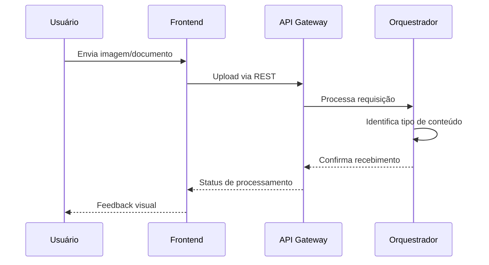
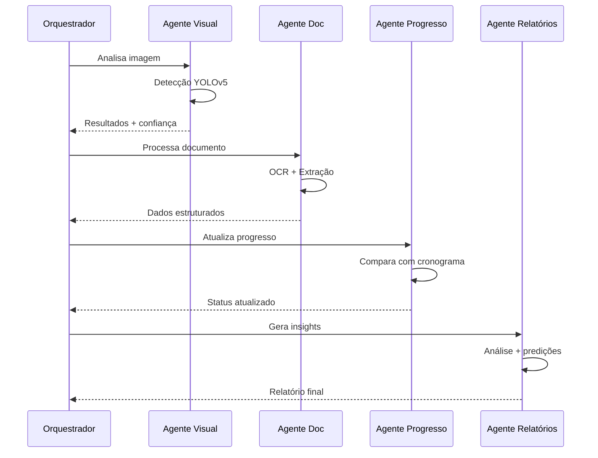
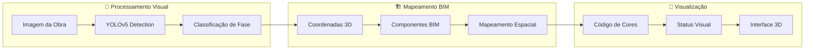

# 🏗️ Arquitetura do Sistema - Agente de Análise de Engenharia

## 📋 Visão Geral

Sistema inteligente inspirado na pesquisa "Integration of Construction Progress Monitoring Results using AI Image Recognition from Multiple Cameras onto A BIM" que combina reconhecimento de imagem por IA, BIM e agentes inteligentes para automatizar análise de projetos de construção.

## 🎯 Arquitetura Geral

```mermaid
graph TB
    %% Frontend Layer
    subgraph "🌐 Frontend - React"
        UI[Interface de Chat]
        CAM[Captura de Câmera]
        UP[Upload de Arquivos]
        AUD[Gravação de Áudio]
        VIS[Visualização BIM]
    end

    %% API Gateway
    subgraph "🚪 API Gateway"
        REST[REST Endpoints]
        WS[WebSocket Real-time]
        AUTH[Autenticação]
    end

    %% Backend Core
    subgraph "🤖 Backend - Agentes Inteligentes"
        ORCH[Orquestrador Principal]

        subgraph "👥 Agentes Especializados"
            AV[Agente Visual]
            AD[Agente Documentação]
            AP[Agente Progresso]
            AR[Agente Relatórios]
        end

        subgraph "🔧 Serviços Core"
            IMG[Processamento de Imagem]
            OCR[Análise de Documentos]
            BIM[Integração BIM]
            AI[Modelos IA/LLM]
        end
    end

    %% Data Layer
    subgraph "💾 Camada de Dados"
        DB[(PostgreSQL)]
        FS[Sistema de Arquivos]
        CACHE[Redis Cache]
    end

    %% External Services
    subgraph "🌍 Serviços Externos"
        OR[OpenRouter (Grok-4 Fast / Gemini 2.5)]
        LANG[LangChain/LangGraph]
        CLOUD[Cloud Storage]
    end

    %% Connections
    UI --> REST
    CAM --> REST
    UP --> REST
    AUD --> WS
    VIS --> WS

    REST --> ORCH
    WS --> ORCH
    AUTH --> DB

    ORCH --> AV
    ORCH --> AD
    ORCH --> AP
    ORCH --> AR

    AV --> IMG
    AD --> OCR
    AP --> BIM
    AR --> AI

    IMG --> OR
    OCR --> LANG
    BIM --> FS
    AI --> OR

    ORCH --> DB
    ORCH --> CACHE
    IMG --> FS
    OCR --> FS
```

## 🤖 Arquitetura dos Agentes

### 1. **Agente Visual (Computer Vision)**
```python
Responsabilidades:
- Análise de imagens/vídeos de construção
- Detecção de objetos e fases construtivas
- Classificação de progresso (YOLOv5 + Transfer Learning)
- Identificação de: ferragem, fôrmas, concretagem
- Integração com múltiplas câmeras

Tecnologias:
- YOLOv5 com CSPDarknet53
- OpenRouter (modelo google/gemini-2.5-flash-image-preview)
- OpenCV para pré-processamento
- Transfer Learning com MS COCO dataset
```

### 2. **Agente de Documentação (Document Intelligence)**
```python
Responsabilidades:
- Processamento de plantas técnicas
- Extração de especificações
- Análise de cronogramas
- OCR de documentos escaneados
- Estruturação de dados técnicos

Tecnologias:
- LangExtract para extração estruturada
- Tesseract OCR
- PyPDF2 para PDFs
- spaCy para NLP
```

### 3. **Agente de Progresso (Progress Monitoring)**
```python
Responsabilidades:
- Comparação com cronograma planejado
- Cálculo de desvios temporais
- Mapeamento BIM 4D
- Atualização automática de status
- Detecção de atrasos/adiantamentos

Tecnologias:
- Integração BIM (IFC files)
- Algoritmos de comparação temporal
- Unity para visualização 3D
- Physic.Raycast para mapeamento
```

### 4. **Agente de Relatórios (Intelligence & Insights)**
```python
Responsabilidades:
- Geração de relatórios automatizados
- Análise de tendências
- Predições baseadas em dados históricos
- Insights para tomada de decisão
- Notificações proativas

Tecnologias:
- LangChain para geração de texto
- OpenRouter (Grok-4 Fast chat, Gemini 2.5 visão)
- Matplotlib/Plotly para gráficos
- Pandas para análise de dados
- Jinja2 para templates
```

## 🔄 Fluxo de Processamento

### 1. **Captura de Dados**


### 2. **Processamento por Agentes**


### 3. **Integração BIM e Visualização**


## 🗄️ Modelo de Dados

### **Tabelas Principais**

```sql
-- Projetos
projects (
    id UUID PRIMARY KEY,
    name VARCHAR(255),
    description TEXT,
    created_at TIMESTAMP,
    bim_model_path VARCHAR(500),
    schedule_data JSONB
);

-- Componentes BIM
bim_components (
    id UUID PRIMARY KEY,
    project_id UUID REFERENCES projects(id),
    component_type VARCHAR(100), -- column, wall, beam
    coordinates JSONB, -- {x, y, z, rotation}
    planned_phase VARCHAR(50),
    current_phase VARCHAR(50),
    progress_percentage DECIMAL(5,2)
);

-- Análises de Imagem
image_analyses (
    id UUID PRIMARY KEY,
    project_id UUID REFERENCES projects(id),
    image_path VARCHAR(500),
    analysis_results JSONB,
    detection_confidence DECIMAL(5,2),
    processed_at TIMESTAMP,
    camera_position JSONB
);

-- Histórico de Progresso
progress_history (
    id UUID PRIMARY KEY,
    component_id UUID REFERENCES bim_components(id),
    previous_phase VARCHAR(50),
    new_phase VARCHAR(50),
    change_date TIMESTAMP,
    confidence_score DECIMAL(5,2),
    source_type VARCHAR(50) -- manual, ai_detection, schedule
);

-- Conversas dos Agentes
agent_conversations (
    id UUID PRIMARY KEY,
    project_id UUID REFERENCES projects(id),
    agent_type VARCHAR(50),
    user_message TEXT,
    agent_response TEXT,
    attachments JSONB,
    created_at TIMESTAMP
);
```

## 🔧 Stack Tecnológico

### **Backend**
```yaml
Linguagem: Python 3.11+
Framework: FastAPI
Agentes: LangChain + LangGraph + LangSmith
IA/ML:
  - OpenRouter (modelo google/gemini-2.5-flash-image-preview)
  - YOLOv5 (Ultralytics)
  - LangExtract (Google)
  - OpenCV
Banco: PostgreSQL 15+
Cache: Redis
Processamento: Celery (tarefas assíncronas)
```

### **Frontend**
```yaml
Framework: React 18 + TypeScript
UI: Material-UI / Chakra UI
Estado: Zustand / Redux Toolkit
3D: Three.js / React Three Fiber
Comunicação: Axios + Socket.IO
PWA: Service Workers
```

### **Infraestrutura**
```yaml
Deploy: Railway
Storage: Railway Volumes / AWS S3
Monitoramento: Railway Metrics + LangSmith
CI/CD: GitHub Actions
Containerização: Docker
```

## 📊 Métricas e Monitoramento

### **KPIs do Sistema**
- **Precisão de Detecção**: >85% (YOLOv5 otimizado)
- **Tempo de Resposta**: <2s para análise de imagem
- **Disponibilidade**: 99.5% uptime
- **Throughput**: 100 análises/minuto

### **Métricas dos Agentes**
- **Taxa de Sucesso por Agente**: >90%
- **Tempo Médio de Processamento**: <5s
- **Confiabilidade das Predições**: >80%
- **Satisfação do Usuário**: >4.5/5

## 🔒 Segurança e Compliance

### **Autenticação & Autorização**
- JWT tokens com refresh
- Role-based access control (RBAC)
- Rate limiting por usuário
- Auditoria de ações

### **Proteção de Dados**
- Criptografia em repouso (AES-256)
- Criptografia em trânsito (TLS 1.3)
- Backup automático diário
- LGPD/GDPR compliance

## 🚀 Escalabilidade

### **Horizontal Scaling**
- Múltiplas instâncias do backend
- Load balancer (Railway)
- Cache distribuído (Redis Cluster)
- CDN para assets estáticos

### **Vertical Scaling**
- Auto-scaling baseado em CPU/memória
- Otimização de queries SQL
- Compressão de imagens
- Lazy loading no frontend

---

**📝 Nota**: Esta arquitetura é baseada nas melhores práticas identificadas na pesquisa acadêmica analisada, adaptada para um MVP escalável e pronto para produção.